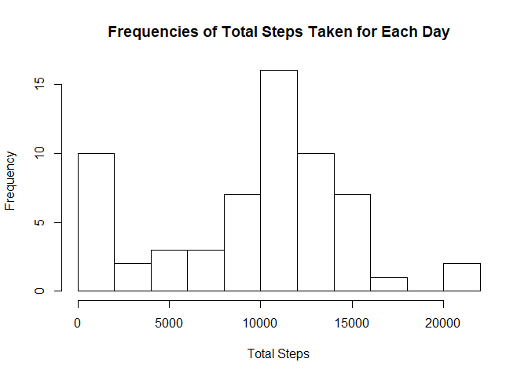
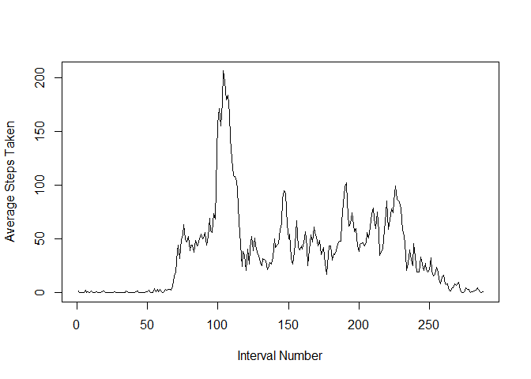
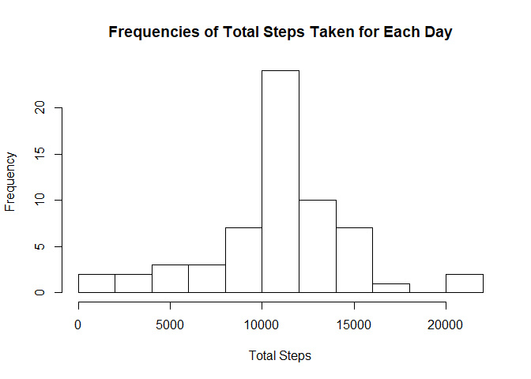
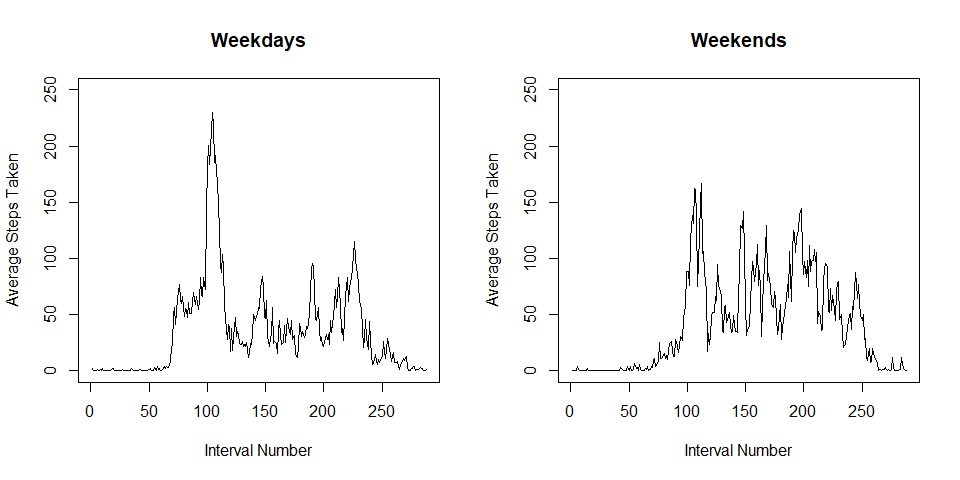

## Loading and preprocessing the data

The following code chunk will unzip, then load the data from the activity.zip file, which was included in the forked repository.


```r
filename <- unzip('activity.zip')
# interval is loaded as an integer then converted to a factor to preserve the numeric order (instead of alphabetical)
act <- read.csv(filename, colClasses = c('integer', 'Date', 'integer'))
```

## What is mean total number of steps taken per day?

The following code chunk will calculate the total number of steps taken each day. It will then produce a histogram of the total number of steps taken each day. 


```r
daily <- tapply(act$steps, act$date, sum, na.rm = T)
hist(daily, breaks = 10, main = 'Frequencies of Total Steps Taken for Each Day', xlab = 'Total Steps')
```

<!-- -->

Finally, calculate the mean and median of the total number of steps taken for each day.


```r
meansteps <- mean(daily)
medsteps <- median(daily)
```

The mean number of total steps taken for each day is **9354.22950819672**.  
The median number of total steps taken for each day is **10395**.

## What is the average daily activity pattern?

The following code chunk will make a time series plot of the 5-minute interval (x-axis) and the average number of steps taken, averaged across all days (y-axis). Then, the time interval with the greatest average number of steps taken will be determined. Note that the x axis represents the 5-minute intervals by their order (so 500 indicates the 500th interval of the day).


```r
byint <- tapply(act$steps, act$interval, mean, na.rm = T)
plot(1:length(byint), byint, type = 'l', xlab = 'Interval Number', ylab = 'Average Steps Taken')
```

<!-- -->

```r
maxindex <- which(byint == max(byint))
maxint1 <- act$interval[maxindex]
maxint2 <- act$interval[maxindex+1]
```

The time interval with the greatest average number of steps taken is from **835** to **840**.

## Imputing missing values

The following code chunk will help determine the number of missing values.


```r
nasum <- sum(is.na(act$steps))
```

A total of **2304** data points have missing values.  

The next code chunk will create a new dataset, act2, where missing step values are replaced with the mean step values for each time interval.


```r
act2 <- act
narows <- which(is.na(act2$steps))
for (i in 1:length(narows)){
        x <- act2$interval[narows[i]]
        y <- byint[unique(act2$interval) == x]
        act2$steps[narows[i]] <- y
}
```

Finally, a histogram is made with the new imputed data, and the mean and median are recomputed.


```r
daily2 <- tapply(act2$steps, act2$date, sum, na.rm = T)
hist(daily2, breaks = 10, main = 'Frequencies of Total Steps Taken for Each Day', xlab = 'Total Steps')
```

<!-- -->


```r
meansteps2 <- mean(daily2)
medsteps2 <- median(daily2)
```

The mean number of total steps taken for each day is **10766.1886792453**.  
The median number of total steps taken for each day is **10766.1886792453**  

By including the imputed values, the calculated mean and median total steps per day has increased.

## Are there differences in activity patterns between weekdays and weekends?

The following code chunk will first determine which days correspond to weekdays or weekends. Then a new variable daytype will be created indicating whether the date is on a weekday or weekend.


```r
wend <- (weekdays(act$date) == 'Saturday') | (weekdays(act$date) == 'Sunday') 
daytype <- rep('Weekday', times = length(wend))
daytype[wend] <- 'Weekend'
daytype <- as.factor(daytype)
act2$daytype <- daytype
```

The next code chunk will make a panel plot containing a time series plot of the 5-minute interval (x-axis) and the average number of steps taken, averaged across all weekday days or weekend days (y-axis).


```r
byintwday <- tapply(act2$steps[act2$daytype == 'Weekday'], 
                    act2$interval[act2$daytype == 'Weekday'], mean, na.rm = T)
byintwend <- tapply(act2$steps[act2$daytype == 'Weekend'], 
                    act2$interval[act2$daytype == 'Weekend'], mean, na.rm = T)

par(mfrow = c(1, 2))
plot(1:length(byintwday), byintwday, type = 'l', ylim = c(0, 250),
     xlab = 'Interval Number', ylab = 'Average Steps Taken', main = 'Weekdays')
plot(1:length(byintwend), byintwend, type = 'l', ylim = c(0, 250),
     xlab = 'Interval Number', ylab = 'Average Steps Taken', main = 'Weekends')
```

<!-- -->
